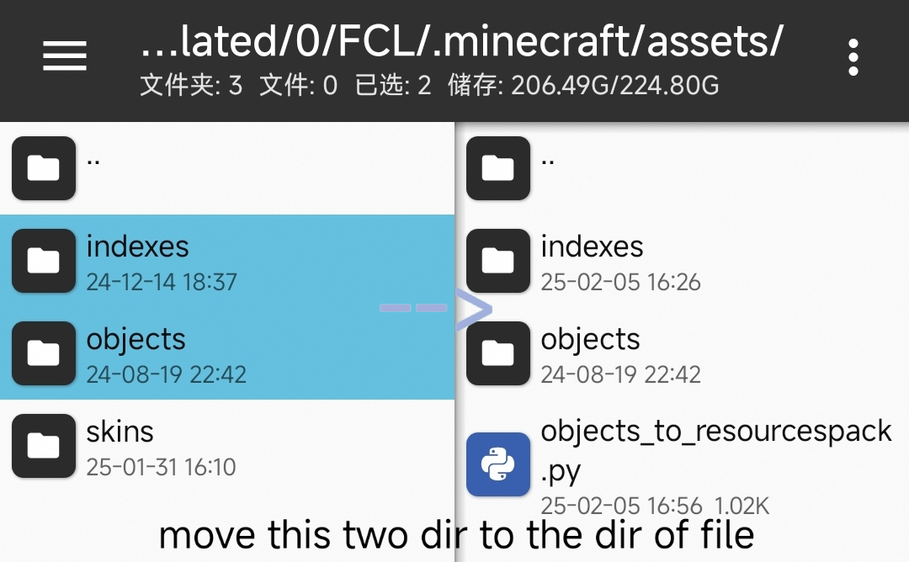

 <h1>objects-to-resourcespack</h1>
 <h2>How to use</h2>
 
 <h5>1. setup Python before use</h5>
 <h5>2. move indexes,objects in dir $minecraftpath/.minecraft/assets/ to project dir</h5>
 <h5>3. run the program,waiting for result</h5>
 <h5>4. the default result will saved to $projectdir/result/ ,you can change it on the code</h5>

